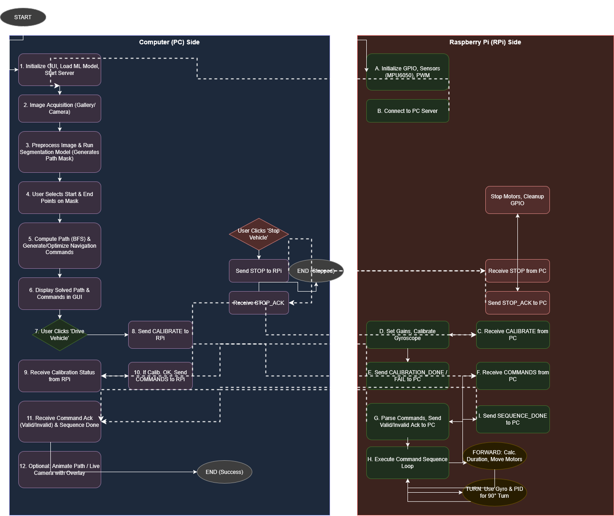
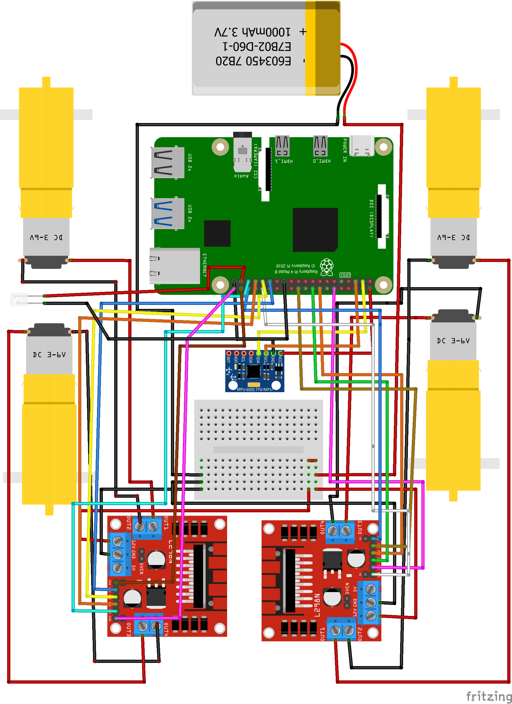
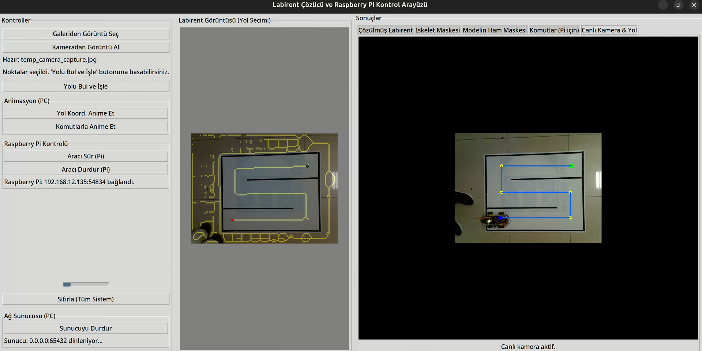

# maze_solver_pi_car_project

* This project was developed as part of the Intelligent Mechatronic Systems course, with the objective of autonomously driving a 4WD car using an overhead camera by detecting lane lines and determining the navigation path via the BFS algorithm.

## Project Diagram 

## Shematic Diagram for Raspberrypi 4

## User Interface

## Demonstration Videos
https://youtu.be/2cHc69dkgjM
